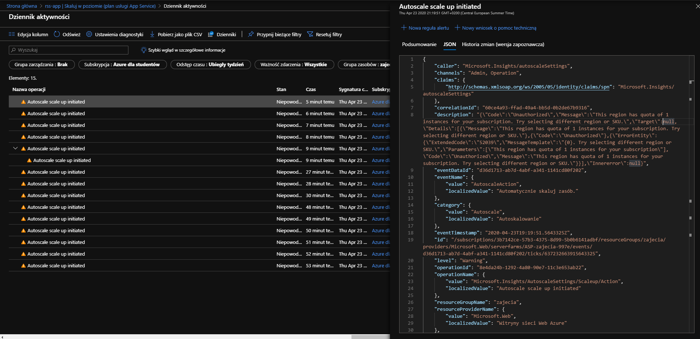
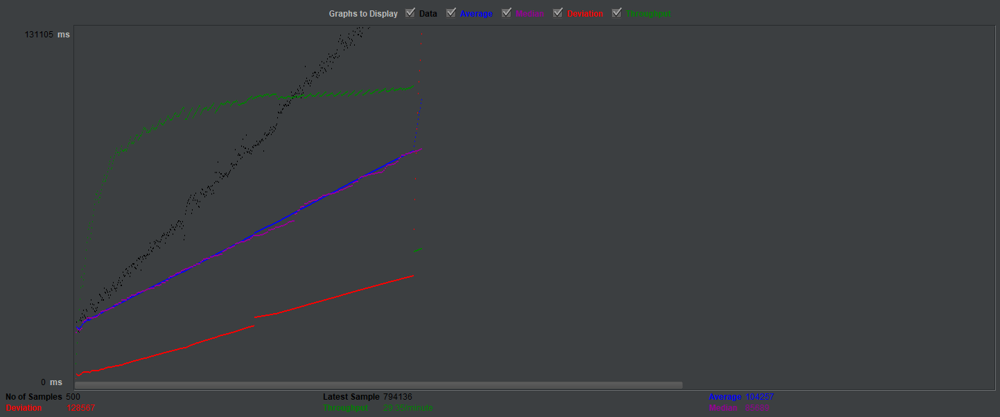
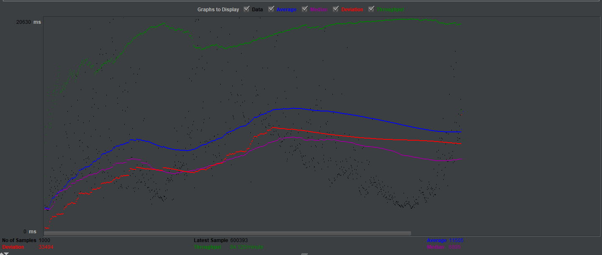

Aplikacja została wdrożona z planem cenowym P1V2, oraz S1, które obsługują automatyczne skalowanie.    
Aplikacja podczas testów z powodu ograniczenia możliwości subskrybcji nie była skalowana.

Do testów zostały użyte następujące adresy RSS:
* http://www.bbc.co.uk/music/genres/rockandindie/reviews.rss
* http://feeds.bbci.co.uk/news/england/london/rss.xml
* http://www.bbc.co.uk/music/genres/world/reviews.rss
* https://www.polsatsport.pl/rss/tenis.xml
* https://www.polsatsport.pl/rss/pilkanozna.xml
* https://news.google.com/rss?topic=h&hl=pl&gl=PL&ceid=PL:pl

Został przetestowany tylko jeden zasób, który zwraca połączone RSS-y.

Do apliakcji działającej na planie cenowym S1 zostało wysłanych 500 requestów. 97.4% zakończyło się powodzeniem.
Średni czas odpowiedzi wyniósł 104257.71 ms. Średnio na sekundę zostało dokonantych 0.49 transakcji.   
Średni czas oczekiwania na odpowiedź dla requestów, które się udały wyniósł 84559.723 ms.

Do apliakcji działającej na planie cenowym P1V2 zostało wysłanych 1000 requestów. 99.5% zakończyło się powodzeniem.
Średni czas odpowiedzi wyniósł 11505.03 ms. Średnio na sekundę zostało dokonantych 1.40 transakcji.   
Średni czas oczekiwania na odpowiedź dla requestów, które się udały wyniósł 5871.655 ms.

Raporty z testów oraz wygenerowane pliki csv znajdują się w katalogu. 23_04.